## Objetivo

El presente manual tiene por objetivo explicar las configuraciones necesarias
para la emisión del aplicativo SICORE (Sistema de Control de Retenciones).

Dicho aplicativo busca informar los regímenes e importes inherentes a
retenciones y percepciones realizadas en un período determinado.

Se podrá emitir el siguiente archivo:

-   Transacciones sobre Retenciones Realizadas de Impuestos a las Ganancias e
    IVA y Percepciones Realizadas de IVA.

## Archivo de Sujetos Retenidos y Percibidos

Los campos que integran el archivo son los siguientes:

-   *Número de documento del Retenido/Percibido:* es el número de documento país
    del cliente o proveedor que realizó o sufrió la percepción o retención
    respectivamente.

    Este campo se toma del maestro Clientes o Proveedores, ubicado en dentro del
    Cliente o Proveedor seleccionado en la Solapa Latam

**Clientes**

**Proveedores**

-   *Razón Social:* es el nombre legal del cliente o proveedor que realizó o
    sufrió la percepción o retención respectivamente.

    ****

-   *Domicilio Fiscal:* es la calle de la dirección principal del cliente o
    proveedor que realizó o sufrió la percepción o retención respectivamente.

-   *Localidad:* es la ciudad de la dirección principal del cliente o proveedor
    que realizó o sufrió la percepción o retención respectivamente.

-   *Provincia:* es el Código de Aplicativo para el Estado de la dirección
    principal del cliente o proveedor que realizó o sufrió la percepción o
    retención respectivamente.

-   Estos campos se toman del maestro de Estados, ubicado en **INFORMACIÓN DE LA
    EMPRESA → CONFIGURACIÓN DE LA APLICACIÓN → CONFIGURACIÓN DE CONTABILIDAD →
    ACCIONES → LATAM → APLICATIVOS DE IMPUESTOS**

-   *Código Postal:* es el código postal de la dirección principal del cliente o
    proveedor que realizó o sufrió la percepción o retención respectivamente.

-   *Tipo de documento del Retenido/Percibido:* es el Código Aplicativo para el
    Tipo de Documento del cliente o proveedor que realizó o sufrió la percepción
    o retención respectivamente.

    Estos campos se toman del maestro Tipos de documento, donde se selecciona
    una de las tipos de documento ya cargados **ACCIONES → APLICATIVO DE
    IMPUESTOS**

## Archivo de Percepciones y Retenciones

Los campos que integran el archivo son los siguientes:

-   *Código de Clase de Comprobante:* es el Código Aplicativo relativo a la
    clase de comprobante para la que se calcula la Retención o Percepción.

    Para las Retenciones, se tomará la clase de comprobante que represente el
    pago desde el Diario de Pagos, como por ejemplo Orden de Pago:

Se debe ingresar al formulario ubicado en **LATAM → COMPROBANTE → CLASE DE
COMPROBANTE → ACCIONES → APLICATIVO DE IMPUESTOS**

Para las Percepciones, se tomará la clase de comprobante que represente la
venta, como por ejemplo Factura, Nota de Crédito, Nota de Débito, etc.:

-   *Fecha de emisión del comprobante (DD/MM/YYYY):* es la fecha en que se
    registró el comprobante de retención o de percepción.

    Para las Retenciones, el dato se tomará del campo Fecha de documento, de la
    línea de retenciones. Las transacciones se ingresarán mediante el formulario
    ubicado en

    **TESORERIA → DIARIOS DE PAGOS → SECCION DE DIARIO**

    

Para las Percepciones, el dato se tomará del campo Fecha del comprobante
original en el cual se ha calculado la percepción.

-   *Número del comprobante:* es el número de comprobante de la línea de tipo
    Proveedor o Cliente donde se calcularon las retenciones (Pagos) o
    percepciones (Ventas).

    Para las Retenciones, el dato se tomará de los campos ‘Punto de venta +
    Número de Comprobante’ de la línea de la Orden de Pago.

    ****

    Para las Percepciones, el dato se tomará de los campos ‘Punto de venta +
    Número de Comprobante’ del Comprobante de Ventas en el cual se ha calculado
    la percepción.

    ****

-   *Importe del comprobante:* es el monto de la línea de tipo Proveedor o tipo
    Cliente donde se calcularon las retenciones (Pagos) o percepciones (Ventas).

    Para las Retenciones, el dato se tomará de la línea de Proveedor, el monto
    de la Orden de Pago.

    Para las Percepciones, el dato se tomará del monto total del Comprobante de
    Ventas (Factura, Nota de débito y Nota de crédito).

    ****

-   *Código de impuesto:* es el Código Aplicativo para el Código de Retención o
    Código de Impuesto aplicable para la percepción o retención respectivamente.

    Para las retenciones el dato se toma del formulario Aplicativos del Código
    de Retención que tiene asociada la clase de comprobante de la retención
    LATAM\>\>CLASE DE COMPROBANTES\>\> ACCIONES\>\> LATAM RELACIÓN DE APLICATIVO
    DE IMPUESTO

    

    

    Para las percepciones el dato se toma del formulario Aplicativos del Código
    de Impuesto que tiene asociado el cliente. El campo se toma del
    JURISDICCIONES FISCALES

    ****

-   *Código de régimen:* es el código de Régimen para el Código de Retención o
    Código de Impuesto aplicable para la percepción o retención respectivamente.

    Para las retenciones el dato se toma del formulario Aplicativos del Código
    de Retención que tiene asociado el proveedor. **LATAM → CLASE DE
    COMPROBANTES → ACCIONES → LATAM DE APLICATIVO DE IMPUESTO**

    

    

    Para las percepciones el dato se toma del formulario Aplicativos del Código
    de Impuesto que tiene asociado el cliente. El campo se toma de
    **JURISDICCIONES FISCALES → SELECCIONO EL CODIGO → LATAM → APLICATIVO DE
    IMPUESTOS**

    ****

    **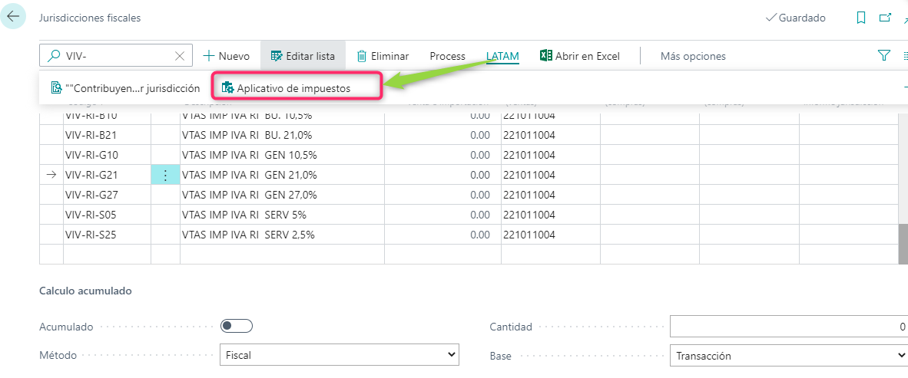**

    ****

-   *Código de operación:* si se trata de una Retención, se informará el número
    ‘1’ en este campo. En cambio, si se trata de una Percepción, se informará el
    número ‘2’ en este campo.

    ****

-   *Base de cálculo:* en este campo, se informará la base sujeta a retención o
    percepción, según corresponda.

    Para las Retenciones, en el Diario de Pagos, para la línea de Retención, el
    campo de donde se tomará la información será ‘Base Imponible’. En el reporte
    se configurará que esta información se muestre en la columna ‘Base de
    retención’.

    

    Para las Percepciones, el campo de donde se tomará la información será
    Origen del monto desde la ventana Impuestos sobre las ventas, del
    comprobante de Ventas. En el reporte se configurará que esta información se
    muestre en la columna ‘Base de percepción’.

    

-   *Fecha de Emisión de la retención (DD/MM/YYYY):* es la fecha en que se
    registró el comprobante de retención o de percepción.

    Para las Retenciones, el dato se tomará del campo Fecha de documento, de la
    línea de retenciones. Las transacciones se ingresarán mediante la siguiente
    ruta:

    **TESORERIA → DIARIOS DE PAGOS → SECCION DE DIARIO**

    **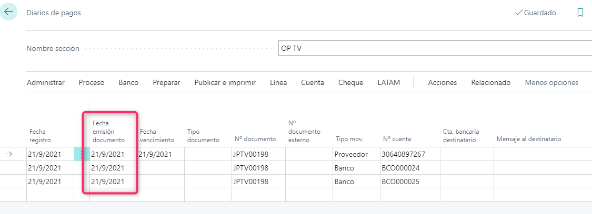**

    Para las Percepciones, el dato se tomará del campo Fecha del comprobante
    original en el cual se ha calculado la percepción.

    ****

-   *Código de Condición:* es el Código Aplicativo para el Tipo de contribuyente
    del cliente o proveedor que realizó o sufrió la percepción o retención
    respectivamente.

    

-   *Retención practicada a sujetos suspendidos***:** este campo siempre se
    informará en 0.

-   *Importe de la Retención/Percepción:* es el monto de las retenciones (Pagos)
    o percepciones (Ventas).

    Para las Retenciones, en el Diario de Pagos, el campo de donde se tomará la
    información será de la línea de retenciones.

    

    Para las Percepciones, el campo de donde se tomará la información será Monto
    de impuesto sobre las ventas calculado desde la ventana Impuestos sobre las
    ventas, del comprobante de Ventas.

    

    *Nota: es muy importante seleccionar el Grupo de Impuestos de Cliente que
    posea la Percepción a realizar ya que, de lo contrario, no se calculará en
    la transacción y será necesario invertirla y cargarla nuevamente, utilizando
    el Grupo de Impuestos que corresponda.*

-   *Porcentaje de exclusión:* Se emite vacío.

-   *Fecha de emisión del boletín:* se emite 01/01/1900

-   *Tipo de documento del retenido:* es el Código Aplicativo para el Tipo de
    documento país del cliente o proveedor que realizó o sufrió la percepción o
    retención.

    Para las retenciones el dato se toma del formulario Aplicativos del Tipo de
    Contribuyente que tiene asociado el proveedor. El campo se toma de LATAM →
    TIPO DE DOCUMENTO

    ****

-   *Número de documento del retenido:* es el número de identificación de País
    (CUIT) del proveedor o cliente. Este dato se tomará del maestro de Cliente o
    Proveedor, Solapa LATAM o de la transacción, si la clase de comprobante está
    configurada como detalla contribuyente:

    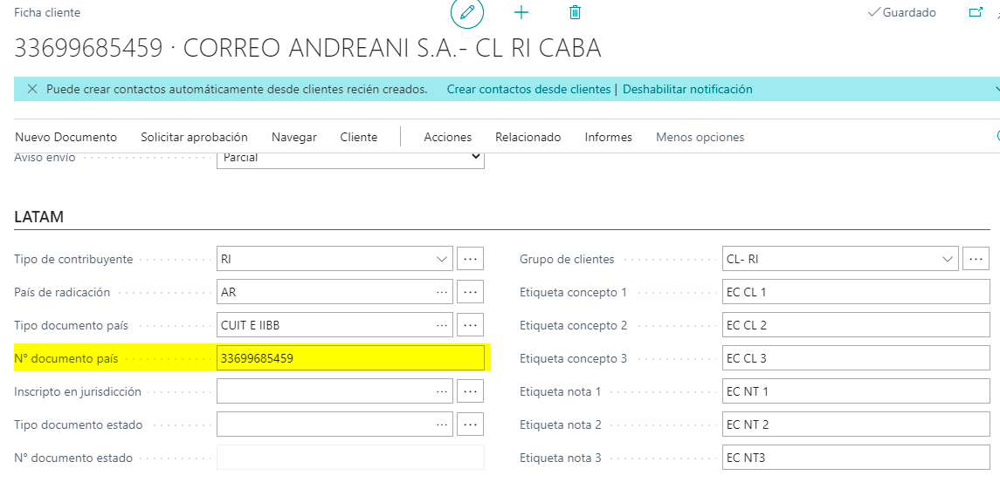

    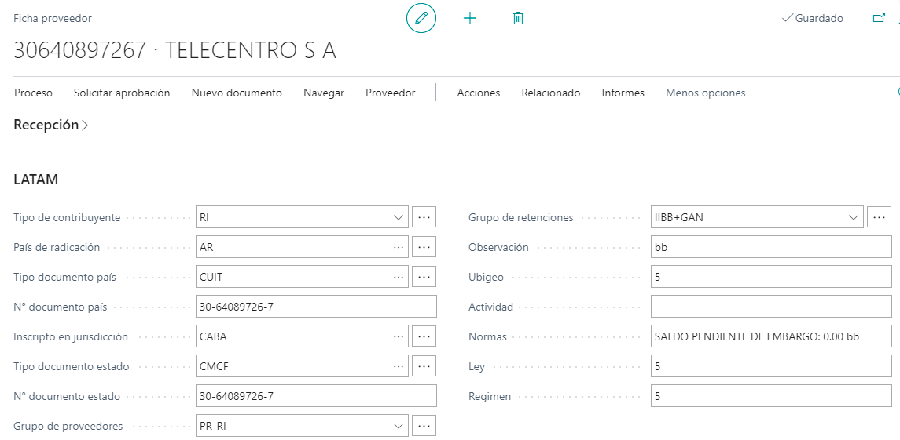

-   *Número certificado original:* este campo se utilizará para informar datos
    de Beneficiarios del Exterior. Dicha funcionalidad no se encuentra abarcada
    por el alcance actual del desarrollo de emisión del archivo.

-   *Denominación del ordenante:* este campo se utilizará para informar datos de
    Beneficiarios del Exterior. Dicha funcionalidad no se encuentra abarcada por
    el alcance actual del desarrollo de emisión del archivo.

-   *Acrecentamiento:* este campo se utilizará para informar datos de
    Beneficiarios del Exterior. Dicha funcionalidad no se encuentra abarcada por
    el alcance actual del desarrollo de emisión del archivo.

-   *CUIT del país del retenido:* este campo se utilizará para informar datos de
    Beneficiarios del Exterior. Dicha funcionalidad no se encuentra abarcada por
    el alcance actual del desarrollo de emisión del archivo.

-   *CUIT del ordenante:* este campo se utilizará para informar datos de
    Beneficiarios del Exterior. Dicha funcionalidad no se encuentra abarcada por
    el alcance actual del desarrollo de emisión del archivo.

## Configuración del Reporteador de Impuestos

A efectos de la generación del Archivo de Retenciones y Percepciones Realizadas
de IVA y Ganancias, será necesaria la confección de un formato de reporte para
esta salida en el formulario ubicado en **CONFIGURACION → LATAM CONFIGURACION DE
REPORTES → REPORTE DE IMPUESTOS**

****

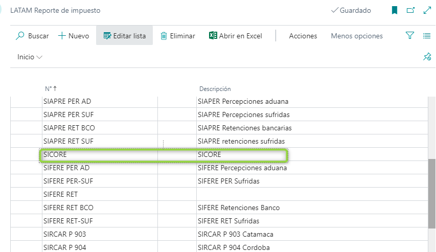

Los campos a completar son los siguientes:

-   *N°:* en este campo se deberá completar el código de identificación del
    reporte que se está parametrizando. Por ejemplo, SICORE.

-   *Descripcion:* en este campo se deberá completar el NOMBRE LEGAL del
    reporte. Es muy importante este campo, ya que será la denominación legal que
    se imprimirá en el reporte. Por ejemplo, SICORE.

Dentro de Acciones se podrán configurar las siguientes solapas

**Solapa Secciones**

Los campos a completar son los siguientes:

-   *Orden 1, 2, 3:* establecerá el orden en el que se mostrarán los
    comprobantes en el aplicativo. Para este caso, las Retenciones se mostrarán
    primero y, a continuación, las Percepciones.

-   *Grupo de clase de comprobante* en este campo se deberá seleccionar los
    conjuntos de comprobantes previamente configurados en el formulario
    ‘Conjunto de clase de comprobantes’. Dichos conjuntos deberán contener
    aquellos comprobantes que donde se calcularon las Retenciones realizadas de
    Impuesto a las Ganancias e IVA (OP) y Percepciones realizadas de IVA
    (FC/ND/NC).

    *PERCEPCIONES*

    

    *RETENCIONES*

    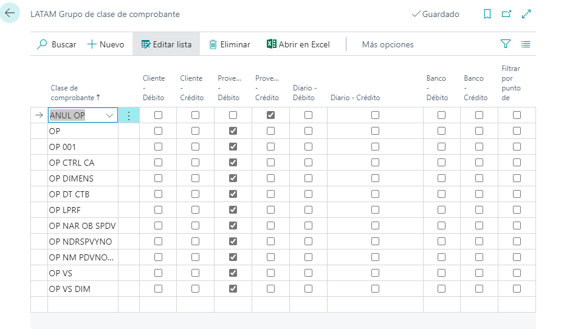

-   *Nombre:* este campo ampliará con una descripción el código indicado en el
    campo ‘Id. de conjunto de comprobantes’. No es un campo editable.

-   *Nombre para mostrar:* este campo se utilizará para asignar el nombre del
    conjunto que deberá visualizarse en el reporte. En caso de estar en blanco,
    en el reporte saldrá vacío.

-   *Invertir el signo:* por cada conjunto de comprobantes se podrá determinar
    si en la visualización del reporte se debe invertir el signo. No será
    necesario marcar para este Archivo.

-   *Filtrar por:* este campo permite seleccionar una de las opciones de
    filtrado que se aplicarán sobre el conjunto de comprobantes seleccionado. La
    opción recomendada es:

-   Sin filtro: no tiene en cuenta ninguna de las columnas siguientes.

**Solapa Columnas**

Para el aplicativo SICORE Transacciones, se deberán configurar seis columnas en
el reporte impositivo, de la siguiente manera:

-   *Columna 1:* Base Percepción

    La primera columna deberá configurarse para mostrar el monto base de las
    percepciones a informar. Por ese motivo, en la grilla de Conjunto de
    impuestos por columna, se deberá configurar como ‘Impuesto: Monto base’,
    seleccionando el Id. De conjunto de impuestos que contenga a las
    percepciones a informar.

    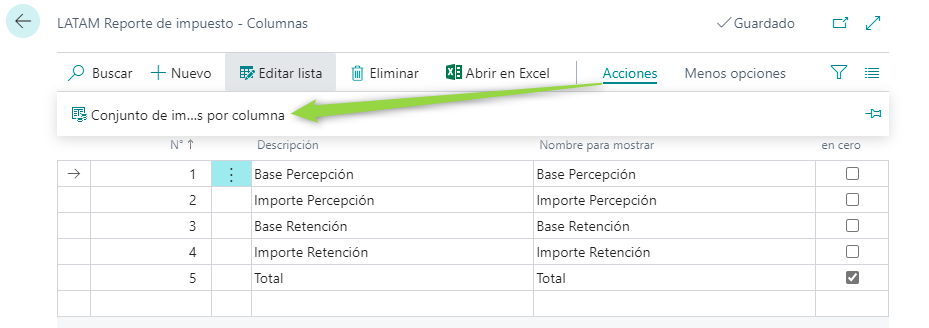

    

    

    

-   *Columna 2:* Importe Percepción

    La segunda columna deberá configurarse para mostrar los montos de
    percepciones. Por ese motivo, en la grilla ‘Tipo de monto por columna’, se
    deberá configurar como ‘Impuesto: Monto’, seleccionando el Id. De conjunto
    de impuestos que contenga a las percepciones a informar, seleccionado en la
    Columna 1.

    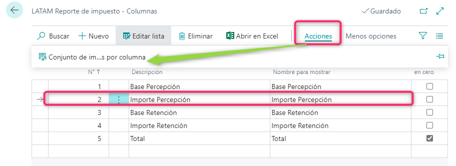

    

-   *Columna 3:* Base Retención

    La tercera columna deberá configurarse para mostrar el monto base de las
    retenciones a informar. Por ese motivo, en la grilla de Conjunto de
    impuestos por columna, se deberá configurar como ‘Retención: Monto base’,
    sin Conjunto de Impuestos por tratarse de retenciones, pero sí con el
    conjunto de retenciones.

    

    

    

    

    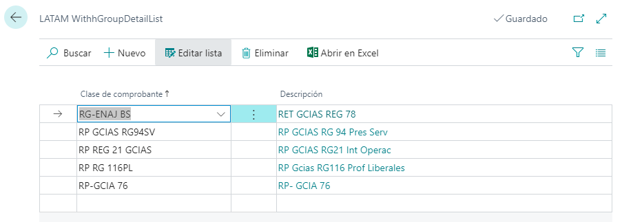

-   *Columna 4:* Importe Retención

    La cuarta columna deberá configurarse para mostrar el importe de las
    retenciones a informar. Por ese motivo, en la grilla de Conjunto de
    impuestos por columna, se deberá configurar como ‘Retención: Monto’.

    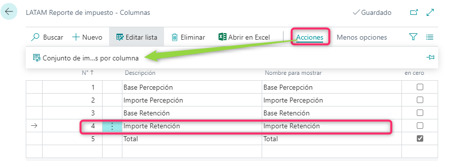

    

-   *Columna 5:* Total

    Esta columna se adicionará a efectos de mostrar sólo las transacciones que
    posean los códigos de impuestos y retenciones configurados en las columnas
    precedentes. Para ello deberá crear una columna y configurarla como ‘Excluir
    Comprobante en Cero’. Adicionalmente en la grilla inferior deberá
    seleccionar ‘Impuesto: Monto Sujeto’ con el conjunto de comprobantes
    seleccionado en la Columna 1 y una línea como ‘Retención: Monto Sujeto’.

    

    

**Solapa General**

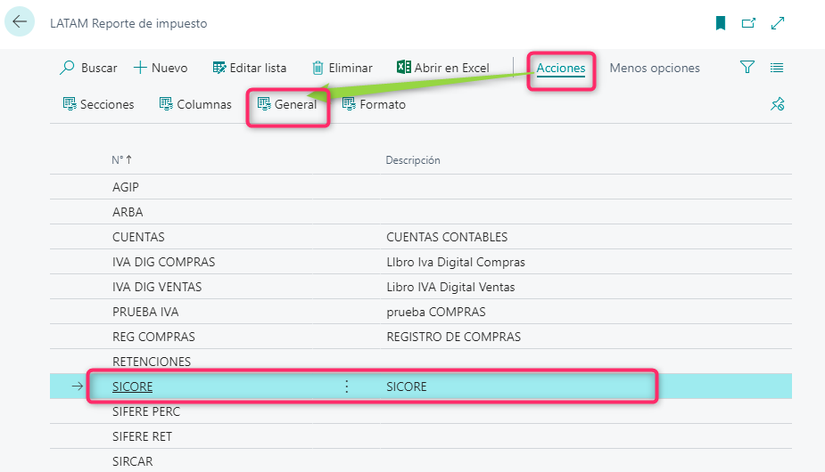

Los campos a completar son los siguientes:

-   *Ordenar por:* este campo permite indicar el orden a tomar en los
    documentos. Se recomienda la opción ‘Fecha + Comprobante + Número de
    documento’

-   *Cantidad de decimales:* este campo permite indicar la cantidad de decimales
    a mostrar en los campos de Tipo monto. Se recomienda colocar 2 decimales.

-   *Separador de miles:* este campo permite indicar el separador de miles a
    utilizar en el reporte a emitir, no del archivo. El archivo tomará como
    separador de miles el Punto (.)

-   *Separador de decimales:* este campo permite indicar el separador de
    decimales a utilizar en el reporte a emitir, no del archivo. El archivo
    tomará como separador de decimales la Coma (,).

    

**Solapa Formato**

Se recomienda asignar un formato de reporte a efectos de poder visualizar la
información ingresada y controlar el contenido de lo informado en el archivo.

****

****

## Definición de exportación de medios magnéticos

Una vez realizada la configuración general para cada archivo será necesario
configurar específicamente la exportación de los archivos, en el formulario
ubicado en **FINANZAS → LATAM → MEDIO MAGNETICOS → DEFINICION DE MEDIOS
MAGNETICOS**

Se deberá configurar un registro por cada salida. Los campos a completar son los
siguientes:

**Solapa General**

-   *ID Medio magnético:* es la identificación del código para exportación del
    archivo magnético. Se recomienda utilizar un código que el usuario que
    exportará el archivo, pueda distinguir.

-   *Descripción:* ingrese una descripción sobre el Tipo de Archivo a Exportar.

**Configuración**

-   *Aplicativo de impuesto:*  Seleccionar el creado en ‘LATAM Aplicativo de
    impuesto’

-   *Reporte de impuestos:* Seleccionar el reporte de la lista desplegable

-   *Reporte ID:* Se debe seleccionar el ID correspondiente al aplicativo. Este
    ID lo proporciona Desarrollo previamente

    **Parámetros**

-   *Parámetros:* en esta grilla se deberán agregar las distintas etiquetas que
    hacen al nombre del archivo a exportar y el tipo de extensión del archivo.

-   Nombre: SICORE

-   Extensión: .txt.

-   *Nombre del archivo:* en este campo se deberán concatenar los campos Nombre
    creados en la grilla Parámetros, precedidos por el símbolo \$ y sin espacios
    entre ellos.

-   *Nombre de archivo traducido:* este campo no es editable, solo tomará los
    campos Valor creados en la grilla Parámetros.

## Exportación de medios magnéticos

Desde este formulario se emitirá el archivo y se determinará dónde debe
guardarse, se puede acceder mediante el formulario ubicado en **INFORMES →
INFORMES FINANACIEROS →LATAM MEDIOS MAGNETICOS → EXPORTACIÓN DE MEDIOS
MAGNÉTICOS.**

Los campos a completar son los siguientes:

-   *ID Medio magnético:* aquí se deberá seleccionar el ID de Exportación,
    configurado en el formulario Definición de exportación de medios magnéticos.

-   *Fecha desde:* es la fecha inicial a partir de la cual se mostrará la
    información. Será la fecha de Registración de las Transacciones.

-   *Fecha hasta:* es la fecha final hasta la cual se mostrará la información.
    Será la fecha de Registración de las Transacciones.

-   *Nombre del archivo:* en este campo no editable se visualiza el nombre
    completo y extensión configurado en la Definición de exportación de archivos
    magnéticos.

## Ejemplos de Archivos exportados

SICORE- Transacciones

